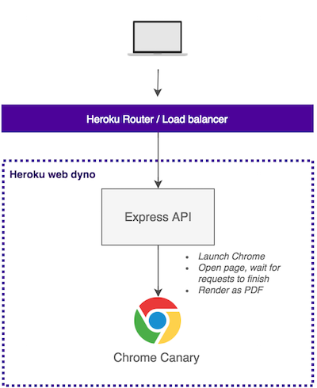

[](https://heroku.com/deploy?template=https://github.com/kimmobrunfeldt/url-to-pdf-api)

# URL to PDF Microservice

> Web page PDF rendering done right. Microservice for rendering receipts, invoices, or any content. Packaged to an easy API.


**WARNING:** *Don't serve this API publicly in the internet unless you are aware of the
risks. It allows API users to run any JavaScript code inside a Chrome in the server.
It's fairly easy to expose content of files in the server. You have been warned!*

**⭐️ Features:**

* Rendered with Headless Chrome, using [Puppeteer](https://github.com/GoogleChrome/puppeteer). The PDFs should match to the ones generated with a desktop Chrome.
* Sensible defaults but everything is configurable
* Single-page app (SPA) support. Waits until all network requests are finished before rendering. **A feature which even most of the paid services don't have.**
* Easy deployment to Heroku. We love Lambda but.. Deploy to Heroku button
* Renders lazy loaded elements *(scrollPage option)*
* Supports optional `x-api-key` authentication. *(`API_TOKENS` env var)*

Usage is as simple as https://url-to-pdf-api.herokuapp.com/api/render?url=http://google.com. There's also a `POST /api/render` if you prefer to send options in the body.

**🔍 Why?**

This microservice is useful when you need to automatically produce PDF files
for whatever reason. The files could be receipts, weekly reports, invoices,
or any content.

PDFs can be generated in many ways, but one of them is to convert HTML+CSS
content to a PDF. This API does just that.

**🚀 Shortcuts:**

* [Examples](#examples)
* [API](#api)
* [I want to run this myself](#development)

## How it works



Local setup is identical except Express API is running on your machine
and requests are direct connections to it.

### Good to know

* **By default, page's `@media print` CSS rules are ignored**. We set Chrome to emulate `@media screen` to make the default PDFs look more like actual sites. To get results closer to desktop Chrome, add `&emulateScreenMedia=false` query parameter. See more at [Puppeteer API docs](https://github.com/GoogleChrome/puppeteer/blob/master/docs/api.md#pagepdfoptions).

* Chrome is launched with `--no-sandbox --disable-setuid-sandbox` flags to fix usage in Heroku. See [this issue](https://github.com/GoogleChrome/puppeteer/issues/290).

* Heavy pages may cause Chrome to crash if the server doesn't have enough RAM


## Examples

*Note: the demo Heroku app runs on a free dyno which sleep after idle.
A request to sleeping dyno may take even 30 seconds.*

**Use the default @media print instead of @media screen.**

https://url-to-pdf-api.herokuapp.com/api/render?url=http://google.com&emulateScreenMedia=false

**Use scrollPage=true which tries to reveal all lazy loaded elements. Not perfect but better than without.**

https://url-to-pdf-api.herokuapp.com/api/render?url=http://www.andreaverlicchi.eu/lazyload/demos/lazily_load_lazyLoad.html&scrollPage=true

**Render only the first page.**

https://url-to-pdf-api.herokuapp.com/api/render?url=https://en.wikipedia.org/wiki/Portable_Document_Format&pdf.pageRanges=1

**Render A5-sized PDF in landscape.**

https://url-to-pdf-api.herokuapp.com/api/render?url=http://google.com&pdf.format=A5&pdf.landscape=true

**Add 2cm margins to the PDF.**

https://url-to-pdf-api.herokuapp.com/api/render?url=http://google.com&pdf.margin.top=2cm&pdf.margin.right=2cm&pdf.margin.bottom=2cm&pdf.margin.left=2cm

**Wait for extra 1000ms before render.**

https://url-to-pdf-api.herokuapp.com/api/render?url=http://google.com&waitFor=1000

**Wait for an element macthing the selector `input` appears.**

https://url-to-pdf-api.herokuapp.com/api/render?url=http://google.com&waitFor=input


## API

To understand the API options, it's useful to know how [Puppeteer](https://github.com/GoogleChrome/puppeteer/blob/master/docs/api.md)
is internally used by this API. The [render code](https://github.com/alvarcarto/url-to-pdf-api/blob/master/src/core/pdf-core.js#L26)
is really simple, check it out. Render flow:

1. **`page.setViewport(options)`** where options matches `viewport.*`.
2. *Possibly* **`page.emulateMedia('screen')`** if `emulateScreenMedia=true` is set.
3. **`page.goto(url, options)`** where options matches `goto.*`.
4. *Possibly* **`page.waitFor(numOrStr)`** if e.g. `waitFor=1000` is set.
5. *Possibly* **Scroll the whole page** to the end before rendering if e.g. `scrollPage=true` is set.

    Useful if you want to render a page which lazy loads elements.

6. **`page.pdf(options)`** where options matches `pdf.*`.


### GET /api/render

All options are passed as query parameters.
Parameter names match [Puppeteer options](https://github.com/GoogleChrome/puppeteer/blob/master/docs/api.md).

These options are exactly the same as its `POST` counterpart, but options are
expressed with the dot notation. E.g. `?pdf.scale=2` instead of `{ pdf: { scale: 2 }}`.

The only required parameter is `url`.

Parameter | Type | Default | Description
----------|------|---------|------------
url | string | - | URL to render as PDF.
scrollPage | boolean | `false` | Scroll page down before rendering to trigger lazy loading elements.
emulateScreenMedia | boolean | `true` | Emulates `@media screen` when rendering the PDF.
waitFor | number or string | - | Number in ms to wait before render or selector element to wait before render.
viewport.width | number | `1600` | Viewport width.
viewport.height | number | `1200` | Viewport height.
viewport.deviceScaleFactor | number | `1` | Device scale factor (could be thought of as dpr).
viewport.isMobile | boolean | `false` | Whether the meta viewport tag is taken into account.
viewport.hasTouch | boolean | `false` | Specifies if viewport supports touch events.
viewport.isLandscape | boolean | `false` | Specifies if viewport is in landscape mode.
cookies[0][name] | string | - | Cookie name (required)
cookies[0][value] | string | - | Cookie value (required)
cookies[0][url] | string | - | Cookie url
cookies[0][domain] | string | - | Cookie domain
cookies[0][path] | string | - | Cookie path
cookies[0][expires] | number | - | Cookie expiry in unix time
cookies[0][httpOnly] | boolean | - | Cookie httpOnly
cookies[0][secure] | boolean | - | Cookie secure
cookies[0][sameSite] | string | - | `Strict` or `Lax`
goto.timeout | number | `30000` |  Maximum navigation time in milliseconds, defaults to 30 seconds, pass 0 to disable timeout.
goto.waitUntil | string | `networkidle` | When to consider navigation succeeded. Options: `load`, `networkidle`. `load` = consider navigation to be finished when the load event is fired. `networkidle` = consider navigation to be finished when the network activity stays "idle" for at least `goto.networkIdleTimeout` ms.
goto.networkIdleInflight | number | `2` | Maximum amount of inflight requests which are considered "idle". Takes effect only with `goto.waitUntil`: 'networkidle' parameter.
goto.networkIdleTimeout | number | `2000` | A timeout to wait before completing navigation. Takes effect only with waitUntil: 'networkidle' parameter.
pdf.scale | number | `1` | Scale of the webpage rendering.
pdf.printBackground | boolean | `false`| Print background graphics.
pdf.displayHeaderFooter | boolean | `false` | Display header and footer.
pdf.landscape | boolean | `false` | Paper orientation.
pdf.pageRanges | string | - | Paper ranges to print, e.g., '1-5, 8, 11-13'. Defaults to the empty string, which means print all pages.
pdf.format | string | `A4` | Paper format. If set, takes priority over width or height options.
pdf.width | string | - | Paper width, accepts values labeled with units.
pdf.height | string | - | Paper height, accepts values labeled with units.
pdf.margin.top | string | - | Top margin, accepts values labeled with units.
pdf.margin.right | string | - | Right margin, accepts values labeled with units.
pdf.margin.bottom | string | - | Bottom margin, accepts values labeled with units.
pdf.margin.left | string | - | Left margin, accepts values labeled with units.


**Example:**

```bash
curl -o google.pdf https://url-to-pdf-api.herokuapp.com/api/render?url=http://google.com
```


### POST /api/render

All options are passed in a JSON body object.
Parameter names match [Puppeteer options](https://github.com/GoogleChrome/puppeteer/blob/master/docs/api.md).

These options are exactly the same as its `GET` counterpart.

**Body**

The only required parameter is `url`.

```js
{
  // Url to render
  url: "https://google.com",

  // If we should emulate @media screen instead of print
  emulateScreenMedia: true,

  // If true, page is scrolled to the end before rendering
  // Note: this makes rendering a bit slower
  scrollPage: false,

  // Passed to Puppeteer page.waitFor()
  waitFor: null,

  // Passsed to Puppeteer page.setCookies()
  cookies: [{ ... }]

  // Passed to Puppeteer page.setViewport()
  viewport: { ... },

  // Passed to Puppeteer page.goto() as the second argument after url
  goto: { ... },

  // Passed to Puppeteer page.pdf()
  pdf: { ... }
}
```

**Example:**

```bash
curl -o google.pdf -XPOST -d'{"url": "http://google.com"}' -H"content-type: application/json" https://url-to-pdf-api.herokuapp.com/api/render
```

## Development

To get this thing running, you have two options: run it in Heroku, or locally.

The code requires Node 8+ (async, await).

#### 1. Heroku deployment

Scroll this readme up to the Deploy to Heroku -button. Click it and follow
instructions.

**WARNING:** *Heroku dynos have a very low amount of RAM. Rendering heavy pages
may cause Chrome instance to crash inside Heroku dyno. 512MB should be
enough for most real-life use cases such as receipts. Some news sites may need
even 2GB of RAM.*


#### 2. Local development

First, clone the repository and cd into it.

* `cp .env.sample .env`
* Fill in the blanks in `.env`
* `source .env` or `bash .env`

  Or use [autoenv](https://github.com/kennethreitz/autoenv).

* `npm install`
* `npm start` Start express server locally
* Server runs at http://localhost:9000 or what `$PORT` env defines


### Techstack

* Node 8+ (async, await), written in ES7
* [Express.js](https://expressjs.com/) app with a nice internal architecture, based on [these conventions](https://github.com/kimmobrunfeldt/express-example).
* Hapi-style Joi validation with [express-validation](https://github.com/andrewkeig/express-validation)
* Heroku + [Puppeteer buildpack](https://github.com/jontewks/puppeteer-heroku-buildpack)
* [Puppeteer](https://github.com/GoogleChrome/puppeteer) to control Chrome
